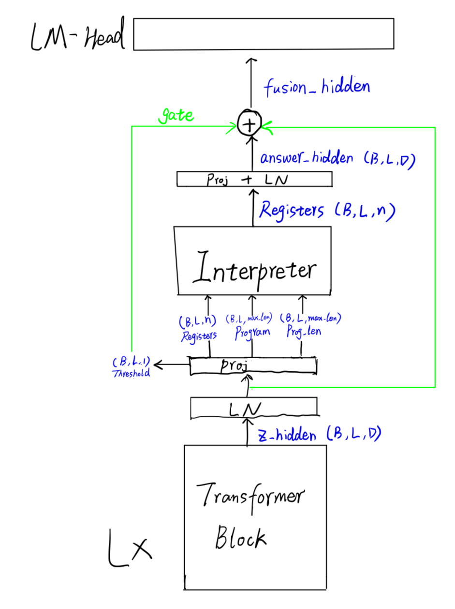
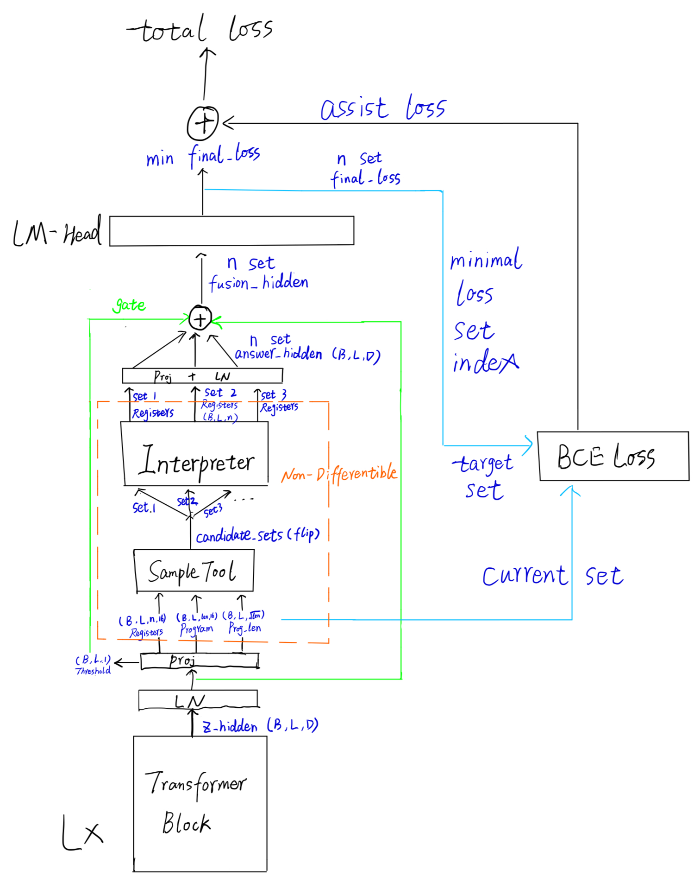

## Neural Execution Machine

#### Gradient framework

TBD:
- 如何让 int 表示的 <code>Instruction</code> 可微
- 如何让 <code>Instruction</code> 的 bit-to-decimal 过程可微

#### Gradient-free framework
- 将 <code>Register</code>, <code>Instruction</code> 等的表示方法转为bit表示，而不是索引 -> 用于 bit flip
    
    e.g instruction shape: (B,L,prog_maxlen,16)
- 通过 <code>SampleTool</code> 来采样 candidate sets， 所有 set 并行计算，找出 loss 最小的set 设为 *target set*，*target set* 作为 label 指导 <code>Register</code>, <code>Instruction</code>等的生成
- 两种 loss 分别指导不同部分的梯度更新
    
    ##### <code>final loss</code>: 指导 lm-head，register2hidden layer
    ##### <code>assist loss</code>: 指导 一开始的 proj layer
    ##### 中间部分 non-differentible

